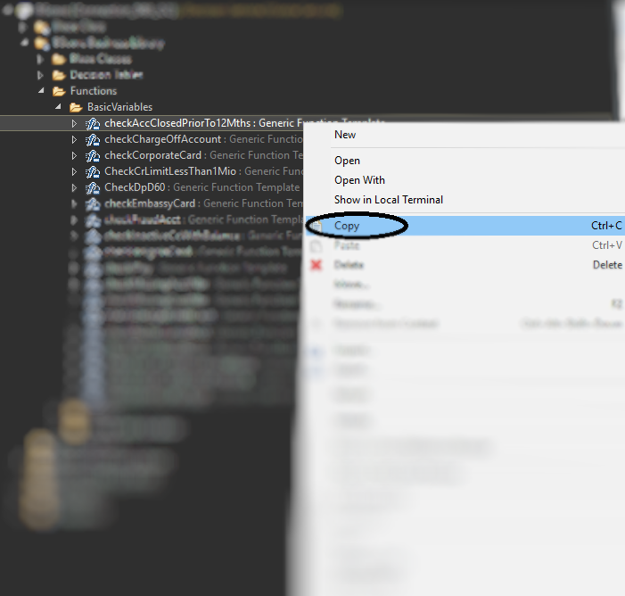
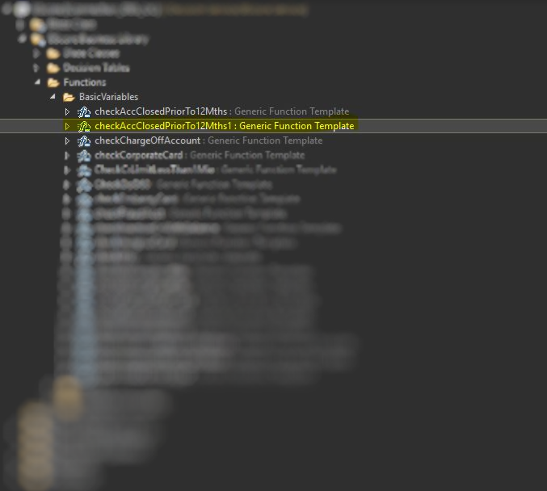
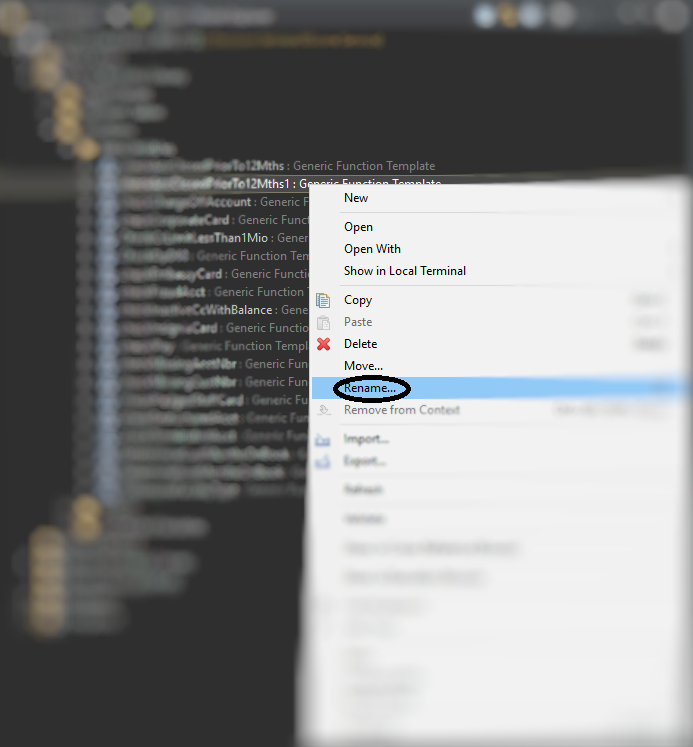
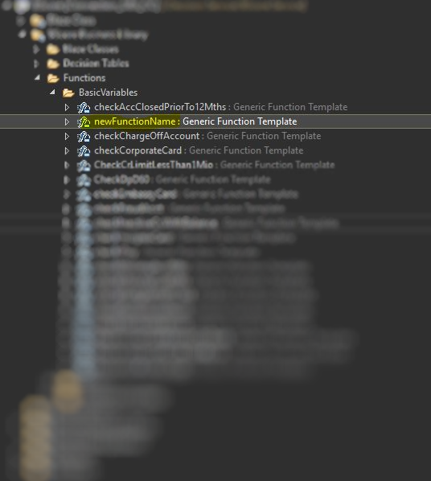
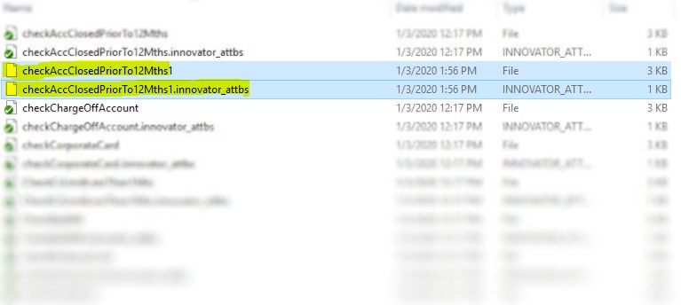
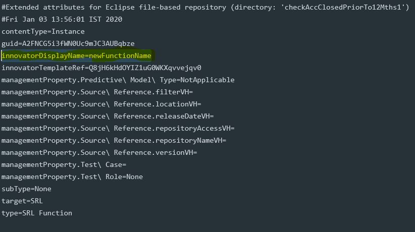

# renameBlazeEntities
A small utility which renames the Blaze Advisor entities/folders/files according to the proper name which is present in the respective innovator_attbs file.

### Why this utility?
* Sometimes while creating entities in IDE(eclipse), the updated names are not reflected in the backend(folder structure).
* Example
  
  
  * Duplicated an existing function, let's say, checkAccClosedPriorTo12Mths()
  
  
  * A __"1"__ is appended at the end of the function name when a duplicate is made.
  
  
  * Renaming it via the IDE doesn't do the whole job. The renamed function will work fine and give no errors, but the actual file in the system will still retain the older name.
  
  
  
  
  * Going over to where all the files are stored, the name present is not the one which we renamed it with.
  
  
  * The renamed name is actually stored in the attribute file. Opening it we can see the actual name that is being used.
  
  
  
## Contents & How to use
* The folder [main](main) contains a __.bat__ file and a __.exe__ file.(standalone exe created using PyInstaller). 

* Run the [_runner.bat_](main/runner.bat) file. It will ask you to paste the path of the desired directory. 

* Copy paste the exact path of the directory where you want to rename the entities and press enter. This script works recursively, i.e. given a parent folder, it will recursively go into all the folders and files inside, making changes along the way.

* The [_renameEntities.exe_](main/renameEntities.exe) file is a standalone exe file generated using [PyInstaller](https://pypi.org/project/PyInstaller/).

* The python code used for this task is also provided in the repo, if you're curious.
